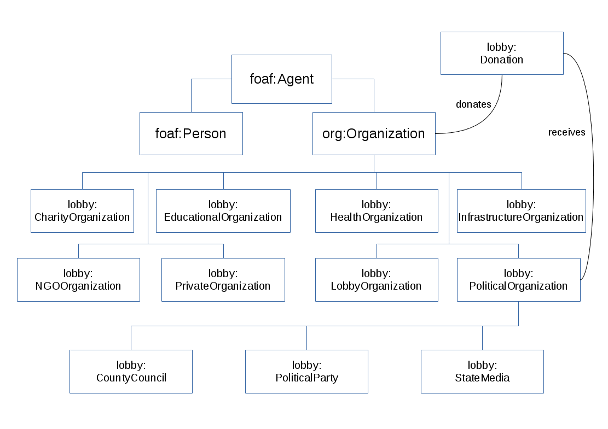
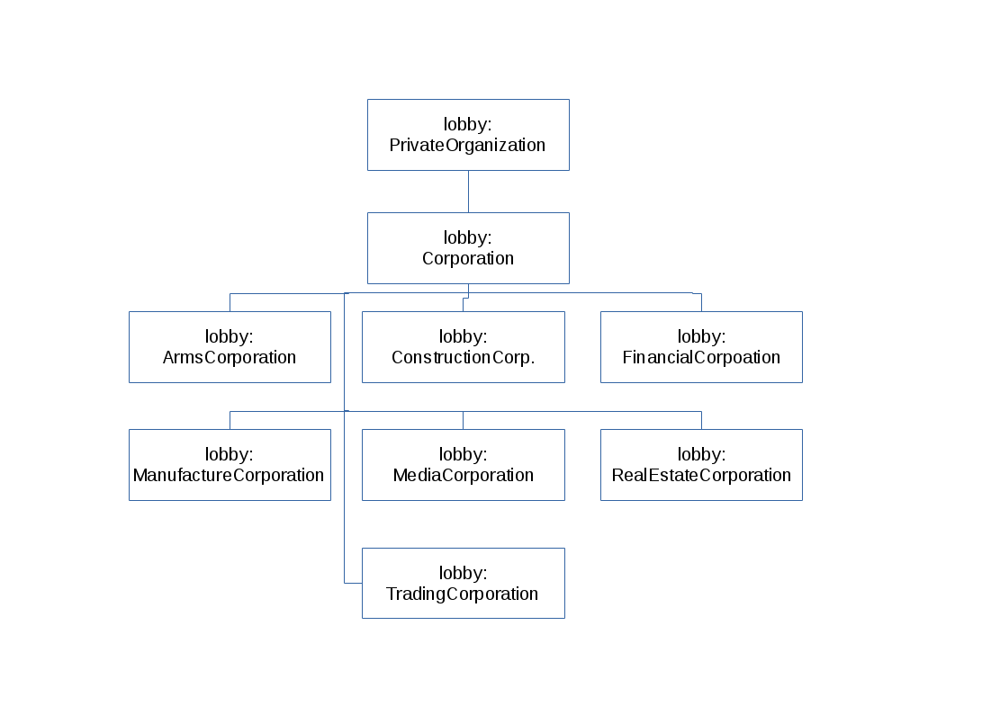
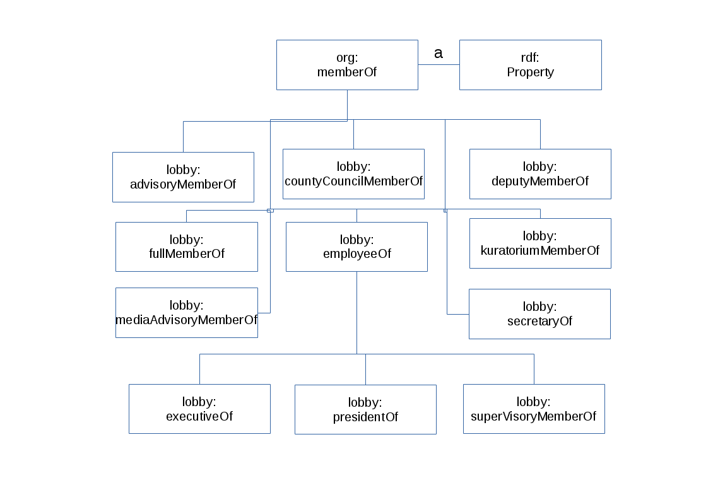

# Das Lobbyradar
Gegenstand der Belegarbeit war das Lobbyradar (www.lobbyradar.de), ein Projekt von ZDF heute.de in Kooperation mit dem Medieninnovationszentrum Babelsberg und OpenDataCity. 
Ziel des Lobbyradar ist es, Verbindungen von Politik, Wirtschaft und ihren Interessenvertretungen aufzuzeigen und mit Quellen zu belegen und somit zu mehr Transparenz in der deutschen Lobby- und Politiklandschaft zu sorgen.
Dazu werden in einer Datenbank alle Daten über Akteure wie beispielsweise Parteien, Firmen, Verbände, NGOs und deren Verbindungen untereinander gesammelt. Diese Verbindungen können Arbeitsverhältnisse, Parteispenden oder anderweitige Einflussnahmen sein.
Die Informationen werden vom ZDF aus unterschiedlichen Datenquellen gesammelt. Vorrangig sind dabei vor allem offizielle Listen über Parteizugehörigkeiten, Parteispenden und Veröffentlichungen von Nebeneinkünften, die außerdem durch manuelle Recherche ergänzt werden. Aktuell umfasst die Datenbank etwas mehr als 26.000 Verbände und Personen und mehr als 30.000 einzelne Verbindungsnachweise unter diesen.
Um den Fokus noch weiter auf die alltägliche Verstrickung von Wirtschaft und Politik zu legen, wurde neben der einfachen Sammlung von (Lobby-)verbindungen auch ein Browser-Plugin entwickelt, das diese während der alltäglichen Verwendung des Internets aufzeigen soll.

Das ZDF stellt die gesammelten Daten außerdem in Form von Datenbankdumps der verwendeten MongoDB, einer dokumentenorientierten NoSQL-Datenbank, für die Öffentlichkeit bereit.
Das Lobbyradar selbst ist Open Source. Für die Datenbankdumps wurde die Open Data Commons Attribution License gewählt, die eine Verwendung, Veränderung und Nutzung (auch im kommerziellen Bereich) der Daten erlaubt.

# Kritik am Lobbyradar-Projekt
Verschiedene Seiten übten seit der Veröffentlichung des Projektes Kritik an diesem. 
Hier wird vor allem auf die Kritik von zwei Internetseiten eingegangen, prreport.de[^prreport] und datenjournalist.de[^datenjournalist].

[^prreport]: http://www.prreport.de/home/aktuell/article/9843-dieser-platte-ansatz-hilft-der-transparenz-debatte-nicht/

[^datenjournalist]: http://datenjournalist.de/warum-das-lobbyradar-so-kaum-zu-gebrauchen-ist/).

## Kritik durch prreport.de 
Die Website prreport.de kritisiert am Lobbyradar vor allem die fragwürdige Glaubwürdigkeit der verwendeten Quellen. Bei einer Überprüfung dieser Quellen fanden die Journalisten Personen in im Lobbyradar mit Verweisen auf das EU-Lobbyregister verzeichnet, die in diesem Lobbyregister allerdings nicht auftauchten. Sie unterstellt dem Lobbyradar somit mindestens eine fehlerhafte Verarbeitung der Quellen, sodass die Informationen zum Teil falsch wiedergegeben werden.
Es sei außerdem nicht erkennbar, welche Informationen durch eine automatisierte Verarbeitung von Datenquellen und welche durch manuelle Recherche hinzugefügt worden seien. Insbesondere Aufgrund einiger fehlerhafter Quellenverweise stellt sich hier die Frage, ob ein Fehler in der automatisierten Verarbeitung vorliegt oder sogar die manuell recherchierten Informationen nicht der Wahrheit entsprechen. 
Neben dem "nicht gelungenen Umgang mit Daten und Quellen" kritisiert der Autor des Artikels weiterhin grundlegend die Haltung, dass Vernetzungen von Wirtschaft und Politik generell nicht wünschenswert sind, die das Lobbyradar-Projekt zumindest anscheinend vertritt. So bedeute eine Vernetzung nicht gleich eine Einflussnahme.
Beispielsweise wäre eine Erläuterung der Rollen der vernetzten Personen im politischen Geschehen wünschenswert um zu erkennen, dass manche Verbindungen schlicht existieren und eher als Teil des politischen Systems zu verstehen sind, nicht als Lobbyismus. Das Lobbyradar könnte so außerdem zur besseren Wissensvermittlung in politischen und volkswirtschaftlichen Themen genutzt werden.

## Kritik durch datenjournalist.de
Der Autor des auf datenjournalist.de erschienenen Artikels erläutert mehr, wie sich die eigentliche Funktion des Lobbyradars, nämlich Transparenz zu schaffen und problematische Vernetzungen aufzudecken, verbessert werden kann.
In erster Linie fordert er dafür eine Möglichkeit, relevante von irrelevanten Informationen zu trennen. Ähnlich wie prreport.de sei eine Vernetzung nicht a priori negativ, sondern erst einmal eine triviale Information. Hier gilt es, insbesondere die wirklich unwichtigen anschließend auszublenden. Ein vom Autor geanntes Beispiel ist: _"blende alle Verbindungen aus, die auf Mitgliedschaften beruhen. Oder zeige mir nur Wirtschaftsverbände sowie Institutionen des Bundestages an."_
Zudem könnten thematische Filter nützlich sein, wie sie das Lobbyradar mittlerweile allerdings schon zum Teil zur Verfügung stellt. Es lassen sich beispielsweise nur Verbindungen aus der Rüstungsindustrie anzeigen. Nutzer können leider aber keine eigenen thematischen Filter erstellen, speichern, verbessern oder publizieren.

# Lösungsmöglichkeiten durch Technologien des semantischen Webs
Das Semantic Web bietet Möglichkeiten um einige dieser Kritikpunkte zu lösen und das Lobbyradar in seiner Gesamtheit zu verbessern.

## Provenance-Informationen
In der Kritik wurde das Problem der unglaubwürdigen Quellen angesprochen. Bisher gibt es im dokumentenorientierten Web keine Möglichkeit, die Glaubwürdigkeit einer Information auszudrücken, weil eine Information in diesem (semantischen, nicht technischen) Sinne nicht existiert. Eine Website ist eine Sammlung von Zeichen, die eine Menge von Aussagen für den Leser, nicht aber für den Computer darstellt.
Durch Konvertierung der Daten in ein Format, das eine automatisierte Verarbeitung semantischer Informationen erlaubt (wie RDF), können Aussagen über die Glaubwürdigkeit eines Wissensfragmentes getroffen werden.
Es können auch mehrere Informationen in einem Graphen gehalten und Aussagen über diesen Graphen getroffen werden. Dafür bieten sich Named Graphs[^namedGraphs] an.

[^namedGraphs]: http://www.w3.org/2004/03/trix/

## Vernetzung mit anderen Datenquellen
Der Autor des Artikels auf prreport.de wünschte ein Anreichern der Daten mit beispielsweise Wissen über die politischen Rollen der Akteure. Dies ist durch semantische Technologien (in der Theorie) leicht zu erreichen. Am naheliegendsten ist eine Verknüpfung der Entitäten in der Wissensdatenbank mit dem entsprechenden Eintrag in der DBpedia[^dbpedia].

[^dbpedia]: http://dbpedia.org

DBPedia ist eine Sammlung strukturierter Daten in RDF-Graphen, die ständig ergänzt wird und den Mittelpunkt von Linked Data darstellt. Diese Verbindung erlaubt ein einfaches Abfragen neuer Informationen wie zum Beispiel der politischen Rolle einer Person und anschließend eines kurzen Beschreibungstextes zu dieser Rolle. Außerdem könnte die Information über den Vorgänger in diesem Amt erlangt werden, dessen Geburtsort, das Wappen dieser Stadt und dessen Zeichner - kurzum, theoretisch jede Information, die letztendlich irgendwie mit einer Entität auch nur im entferntesten Sinne zu tun hat.
Zum Einen kann dadurch die Wissensvermittlung des Lobbyradars verbessert werden, zum Anderen könnten auch eingetragene Informationen verifiziert und ergänzt werden.

## Verbesserte Such- und Abfragemöglichkeiten
Semantisch strukturierte Daten ermöglichen komplexe Suchanfragen und vermeiden gleichzeitig Fehlinformation. Sie lösen zum einen das Problem der Mehrdeutigkeit, also wenn etwa zwei Personen den gleichen Namen tragen. Eine Verwechslung dieser kann eine Fehlinformation mit weitreichenden Auswirkungen darstellen.
Zum anderen lassen sich Datensätze mit komplexen Fragen bearbeiten, die bei herkömmlichen Datenbanken zu unübersichtlichen, großen und ineffizienten Abfragen führen würden.
Einige Beispiele, die sich durch Abfragen mit der "SPARQL Protocol and RDF Query Language" lösen lassen sind:
- _"Nimmt eine Person von mehr als einer Seite Einfluss auf eine Partei?"_
- _"Welche Verbindungen zwischen Akteuren gibt es, die keine Mitgliedschaften sind?"_
- _"Wieviele Unternehmen aus dem Finanzbereich oder Mitglieder dieser Unternehmen haben an eine Partei im Jahre 1994 gespendet und wie groß war die Summe?"_

# Konkrete Zielsetzung
Voraussetzung für jegliche weitere Arbeit und Hauptaugenmerk der Belegarbeit war die Konvertierung des Datenbankdumps des Lobbyradars in einen Graphen logischer Aussagen. Dieser bildet den grundlegenden Baustein für eine weitere Verwendung der Daten unter Ausnutzung der Vorteile semantisch strukturierter Daten.
Zu diesem Zweck soll in erster Linie eine Ontologie entwickelt werden, die eine Einordnung der Entitäten und ihrer Verbindungen in definierte Regeln erlaubt. Es sollen dabei folgende Technologien zum Einsatz kommen:
- Resource Description Framework (RDF) [^rdf]
- RDF Schema [^rdfs]
- Web Ontology Language [^owl]

[^rdf]: www.w3.org/RDF/
[^rdfs]: http://www.w3.org/TR/rdf-schema/
[^owl]: www.w3.org/2004/OWL/

Auf Grundlage dessen kann anschließend eine Anwendung implementiert werden, die die verschiedenen Kritikpunkte des Lobbyradars ausmerzt und insbesondere bessere Such- und Filtermöglichkeiten und durch weitere Quellen angereicherte Daten bereitstellt.

# Der Datensatz
Der Datensatz ist aufgeteilt in zwei Collections, "entities" und "relations". Beide weisen eine mehr oder weniger feste Struktur auf, sind aber von Lücken und problematischen Formatierungen durchsetzt.

## Entities
Beinhaltet den Namen und weitere Aliase einer Entität, ihren Typ und ihr Erstellungsdatum. Außerdem ein Feld `importer`, das vermutlich auf die Quelle der Information verweist, aber nie näher erläutert wird. Ein Wert hier ist zum Beispiel "laender", was keinerlei verwendbare Aussage besitzt.
Der Typ einer Entität wird grob als "person" oder "entity" angegeben.
```
[In]: db.entities.distinct("type")
[Out]: [u'entity', u'person']
```
Ein weiteres wichtiges Feld sind die Tags. Aus diesen lassen sich in einigen Fällen Informationen über die Art der Entität gewinnen. Leider sind hier Provenance-Informationen, Hinweise auf den Typ der Entität und weitere Tags bunt durchmischt. Über die Hälfte der Entitäten besitzen den Tag "Lobbyismus", was entweder die Frage nach dem Informationsgehalt dieses Tags oder danach, welche Entitäten in einem Lobbyradar denn nicht mit Lobbyismus zu tun haben, aufkommen lässt. Manche Tags wie "Lobbyorganisation" oder "Bau" helfen aber tatsächlich, die Entitäten einzuordnen.

Das wichtigste Feld ist das `data`-Array, das die wesentlichen Informationen (abgesehen vom Namen) zu einer Entität enthält. Abhängig vom Feld `data.desc` können hier verschiedene Informationen im Feld `data.value` aufgeführt sein. Am häufigsten sind Quellen, Titel, Adressen, Links, Namen und Fotos.

## Relations
Die Collection `relations` ist ähnlich wie die Collection `entities` aufgebaut, beinhaltet also auch die wesentlichsten Informationen im `data`-Array.
Im Feld `entities` sind die ObjectIds der zwei miteinander Verbundenen Akteure angegeben.

Am wichtigsten ist wieder das Feld `data.desc`, das eine Beschreibung der Verbindungsinformation und damit auch ihr Format angibt. Die drei möglichen Beschreibungen sind
- Verbindung: Hier wird im Feld `data.value.position` die Art der Verbindung angegeben. Das kann beispielsweise eine Vorstandsposition in einem Unternehmen sein.
- Parteispende: Informationen zu einer Spende einer Entität an eine Partei mit Geldwert und Jahr der Spende im Feld `data.value`
- Angaben zur Nebentätigkeit: Informationen zu einer Anstellung in einem Unternehmen im Feld `data.value`


# Entwicklung einer Ontologie
Die Ontologie sollte die verschiedenen Arten von Entitäten, also Organisationen und ihre Subklassen, sowie Personen und die Verbindungen dieser abbilden. 
Grundlage für die Ontologie waren verschiedene, vor allem vom W3C Konsortium empfohlene, Vokabulare:
- The Organization Ontology[^org] als Grundlage für die Modellierung von Organisationen und Verbindungen
- Friend of a friend[^foaf] für Personen (auch Grundlage für The Organization Ontology) und Namen
- vCard[^vcard] zur Beschreibung von Adressen





Die Ontologie ist im Github Repository[^gitrepo] unter `ontology/ontology.owl` oder `ontology/ontology_turtle.owl` im RDF/XML oder Turtle-Format zu finden.

[^org]: http://www.w3.org/TR/vocab-org/
[^foaf]: xmlns.com/foaf/spec/
[^vcard]: www.w3.org/TR/vcard-rdf/
[^gitrepo]: https://github.com/simonArnold/semantic_lobbyradar

## Namespace
Die Ontologie selbst verwendet als Namespace 
`https://studi.f4.htw-berlin.de/~s0539710/lobbyradar/ontology#`.
Die in der Konvertierung entstandenen Fakten verwenden als Namespace für die URIs 
`https://studi.f4.htw-berlin.de/~s0539710/lobbyradar#`

# Konvertierung der Daten
Die Konvertierung der Daten erfolgt in zwei Schritten, Konvertierung der Entitäten und Konvertierung der Relationen.
Der Code befindet sich in `lobbyradar_code/convert_to_rdf.py` bzw `lobbyradar_code/entity_to_rdf.py`

## Konvertierung der Entitäten
Zunächst werden alle Entitäten aus der `entities`-Collection konvertiert.
Dazu wird aus dem Namen der Entität eine URI gebildet:
```
lobbyFacts.term(quote_plus(name.encode("ascii", "ignore")))
```
Aus "Die Linke" wird also beispielsweise 
`"https://studi.f4.htw-berlin.de/~s0539710/lobbyradar#Die+Linke"`. Sicherlich wäre es passender gewesen gleich zum Beispiel die entsprechende DBpedia-Resource als URI zu verwenden, allerdings war eine Entity Resolution an diesem Punkt noch nicht möglich.

Anschließend werden verschiedene Aussagen über die so konvertierte Entität in den Graphen eingetragen. Daraus ergibt sich eine Entität im RDF-Format. Ein verkürztes Beispiel sei hier gezeigt:
```
[In]: sparql.query("DESCRIBE 
    <https://studi.f4.htw-berlin.de/~s0539710/lobbyradar#Gregor+Gysi>")
[Out]:
<https://studi.f4.htw-berlin.de/~s0539710/lobbyradar#Gregor+Gysi>
a                       foaf:Person ;
rdfs:seeAlso            
    <http%3A%2F%2Fwww.linksfraktion.de%2Fabgeordnete%2Fgregor-gysi%2Fprofil%2F> , 
    <http%3A%2F%2Fwww.gregorgysi.de%2F> ;
vcard:hasAddress        [ a                     vcard:Work ;
                                rdfs:label            "Deutscher Bundestag" ;
                                vcard:country-name    "Germany" ;
                                vcard:hasEmail        "gregor.gysi@bundestag.de" ;
                                vcard:hasFN           "Gregor Gysi" ;
                                vcard:hasTelephone    "493022772700" ;
                                vcard:locality        "Berlin" ;
                                vcard:postal-code     "11011" ;
                                vcard:street-address  "Platz der Republik 1"
                                ] ;
ns1:memberOf            
    <https://studi.f4.htw-berlin.de/~s0539710/lobbyradar#Fraktion+Die+Linke> ;
foaf:depiction          
    <http://www.abgeordnetenwatch.de/images/abgeordnete/big/78153/dr_gregor_gysi.jpg> ;
foaf:familyName         "Gysi" , "Gregor" ;
foaf:givenName          "Gregor" , "Gysi" ;
foaf:name               "Gregor Gysi" ;
foaf:title              "Dr." ;
lobbyOntology:alias     [ a       rdf:Bag ;
                            rdf:_1  "Gregor Gysi" ;
                            rdf:_2  "Dr. Gregor Gysi"
                            ] ;
lobbyOntology:mongo_id  "54c2a4b4fe6a42c82bbab01c" .
```
Es wurden aus Zeitgründen nicht alle Informationen aus der Datenbank in RDF konvertiert. Verwendet wurden:

- \_id
- alias
- type
- name
- tags
- Informationen aus `data`: Titel, Adresse, Link, Vorname, Nachname, Foto, Beschreibung

## Konvertierung der Verbindungen
Nachdem alle Entitäten in einen Graphen eingetragen sind, können die Verbindungen dieser untereinander verarbeitet werden. Dazu werden für jeden Eintrag in der Collection `relations` zunächst die URI der beteiligten Entitäten benötigt, die ab diesem Punkt schon durch eine Sparql-Anfrage auf den Graphen der Entitäten abgefragt werden können. Dabei wird auch nach dem Typ der Entitäten gefragt:
```
sparql.query("SELECT ?uri ?type WHERE { ?uri lobbyOntology:mongo_id <gesuchte_entität> ; rdf:type ?type }")
```

Jede Verbindung kann unterschiedliche Typen besitzen:

### "Verbindung"
Eine Verbindung vom Typ "Verbindung" beschreibt eine Position, die eine Entität bei einer anderen einnimmt, wie beispielsweise die eines Vorstandes.
Da der Typ der Entitäten bekannt ist, also ob es sich um eine Person oder eine Organisation handelt, kann leicht bestimmt werden, wie die Verbindung gerichtet ist. Über eine Map wird anschließend die Verbindung in einen Term der Ontologie übersetzt:
```python
positions_map = {
    u"Vorstand": lobbyOntology.term("executiveOf"),
    u"Mitglied": org.term("memberOf"),
    u"Ordentliches Mitglied": lobbyOntology.term("fullMemberOf"),
    u"Stellvertretendes Mitglied": lobbyOntology.term("deputyMemberOf"),
    u"Arbeitsverh\xe4ltnis": lobbyOntology.term("employeeOf"),
    u"Aufsichtsratsmitglied": lobbyOntology.term("supervisoryMemberOf"),
    u"Mitglied des Aufsichtsrates": lobbyOntology.term("supervisoryMemberOf"),
    u"Mitglied des Aufsichtsrats": lobbyOntology.term("supervisoryMemberOf"),
    u"Mitglied des Kuratoriums": lobbyOntology.term("kuratoriumMemberOf"),
    u"Mitglied des Stiftungsrates": lobbyOntology.term("kuratoriumMemberOf"),
    u"Mitglied des Beirates": lobbyOntology.term("advisoryMemberOf"),
    u"Mitglied des Vorstandes": lobbyOntology.term("executiveOf"),
    u"Vorstandsmitglied": lobbyOntology.term("executiveOf"),
    u"Staatssekret\xe4r": lobbyOntology.term("secretaryOf"),
    u'Parlamentarischer Staatssekret\xe4r': lobbyOntology.term("secretaryOf"),
    u"Mitglied im Rundfunkrat": lobbyOntology.term("mediaAdvisoryMemberOf"),
    u"Mitglied des Kreistages": lobbyOntology.term("countyCouncilMemberOf"),
    u"Parlamentarischer Staatssekretär": lobbyOntology.term("secretaryOf"),
    u"Vorsitzender": lobbyOntology.term("president"),
```

### Parteispende
Bei einer Parteispende wird zunächst eine Blank Node vom Typ "Donation" (siehe Ontologie) eingefügt. Diese besitzt Eigenschaften, die den Wert und das Jahr der Spende beschreiben.
Die Spende wird dann für die beiden Entitäten eingetragen:
```
:ParteiEntität lobbyOntology:received \_:d .
:AndereEntität lobbyOntology:donated \_:d .
```

Die Entitäten und Relationen wurden zunächst in zwei unterschiedliche Graphen gespeichert. Kombiniert man diese, erhält ein Dokument mit ungefähr einer halben Million Zeilen von Aussagen im RDF Format.
Gespeichert sind die Graphen in den Dokumenten:
- Entitäten: `lobbyradar_code/entities.xml` oder `lobbyradar_code/entities.ttl`
- Verbindungen: `lobbyradar_code/relations.xml` oder `lobbyradar_code/relations.ttl`

# Anwendungsbeispiele
In diesem Abschnitt werden einige Beispiele von SPARQL-Anfragen auf den Graphen gezeigt.
Allen Beispielen sind die Sparql-Prefixe gemein:
```
PREFIX rdf: <http://www.w3.org/1999/02/22-rdf-syntax-ns#>
PREFIX rdfs: <http://www.w3.org/2000/01/rdf-schema#>
PREFIX foaf: <http://xmlns.com/foaf/0.1/>
PREFIX lobbyOntology: <https://studi.f4.htw-berlin.de/~s0539710/lobbyradar/ontology#>
PREFIX lobbyFacts: <https://studi.f4.htw-berlin.de/~s0539710/lobbyradar#>
PREFIX org: <http://www.w3.org/ns/org#>
PREFIX vcard: <http://www.w3.org/2006/vcard/ns#>
```

### 10 Lobbyorganisationen
Ein einfaches Beispiel, um 10 beliebige Lobbyorganisationen zu finden.
```
[In]: SELECT ?name WHERE {
    ?org rdf:type lobbyOntology:LobbyOrganization ;
        foaf:name ?name
} LIMIT 10

[Out]:
Bundesverband freier Berufsbetreuer e.V.
DAV - Deutsche Aktuarvereinigung e.V.
Deutscher Schwerhörigenbund e.V. DSB
Deutsche Gesellschaft für Recht und Informatik (DGRI) e.V.
Gesellschaft für Wehr- und Sicherheitspolitik e.V.
Stiftung 2° - Deutsche Unternehmer für Klimaschutz
Deutsche Gesellschaft für Ur- und Frühgeschichte (DGUF) e.V.
Deutsche Gesellschaft zur Förderung der Unterwasserarchäologie e.V.
Wissensforum Backwaren e.V. (WFB)
Deutsche Stiftung Mediation
```


### Alle Adressen von Arbeitsstellen von Mitgliedern in Rüstungsorganisationen
Im Output wird hier nur eine Adresse angegeben. Tatsächlich sind es mehrere, die gesamte Ausgabe wäre aber zu lang.

```
[In]: DESCRIBE ?address WHERE {
    ?org rdf:type lobbyOntology:ArmsCorporation .
    ?e org:memberOf ?org ;
        vcard:hasAddress ?address .
}

[Out]:
[ a                   vcard:Work ;
  rdfs:label          "Geschäftsstelle, Hochstadenring 50" ;
  vcard:country-name  "Deutschland" ;
  vcard:hasEmail      "info@dwt-sgw.de" ;
  vcard:hasFN         "Deutsche Gesellschaft für Wehrtechnik e.V. ( DWT)" ;
  vcard:hasTelephone  "+49228410980" ;
  vcard:locality      "Bonn" ;
  vcard:postal-code   "53119"
] .
```

### Alle Personen, die an die Partei FDP gespendet haben zusammen mit Organisationen, in denen diese Personen Mitglied sind
Auch hier ist die Ausgabe wieder verkürzt. Außerdem wurden die Ergebnisse für bessere Lesbarkeit in Sätzen formuliert.

```
[In]: SELECT ?name ?amount ?organization WHERE {
    ?someone lobbyOntology:donated ?donation .
    lobbyFacts:FDP lobbyOntology:received ?donation .
    ?someone foaf:name ?name ;
        org:memberOf ?org.
    ?org foaf:name ?organization .
    ?donation lobbyOntology:amount ?amount .
    }  

[Out]:
Philip Morris GmbH donated 10500.0 to FDP 
    and is member of Bund für Lebensmittelrecht und Lebensmittelkunde e.V. (BLL)
Südzucker AG donated 23008.05 to FDP 
    and is member of Verein der Kohlenimporteure e.V.
Südzucker AG donated 23008.05 to FDP 
    and is member of Bundesverband der Deutschen Süßwarenindustrie e.V. (BDSI)
Südzucker AG donated 23008.05 to FDP 
    and is member of Bund für Lebensmittelrecht und Lebensmittelkunde e.V. (BLL)
Südzucker AG donated 23008.05 to FDP 
    and is member of Bundesvereinigung der Deutschen Ernährungsindustrie e.V. (BVE)
Rainer Brüderle donated 14000.0 to FDP 
    and is member of Kabinett Merkel II
```

### Weitere Beispiele
Mehr Beispiele lassen sich im IPython Notebook `notebooks/SparqlExamples.ipynb` finden. Die Ausführung dieser setzt allerdings einen Sparql-Endpoint unter `127.0.0.1:3030/lobbyradar/sparql` voraus. Dieser wurde in diesem Falle mit Apache Fuseki realisiert.


# Probleme und Ausblick
Generell war leider die Zeit für die Belegarbeit bei weitem nicht ausreichend. Das spiegelt sich in der unfertigen Ontologie, in der nicht vollständig, sondern nur ausgewählt konvertierten Datenbank und insbesondere in der Ungenauigkeit und teilweise Inkorrektheit der konvertierten Daten wider.
Problematisch war dabei vor allem der recht unstrukturierte und mit Fehlern durchsetzte Datenbankdump. Entitäten anhand von Tag-Informationen zu klassifizieren oder Fehler zu beheben, wie URLs, die Leerzeichen enthielten und auch komplett fehlende oder leere Felder brachten die Skripte sehr oft zum Absturz. Da diese Fehler manchmal sehr spät auffallen, kann ein fehlerhaft formatiertes Feld im Datenbankdump viel Arbeit bedeuten. So wurde zum Teil die Formatierung des gesamten Graphs durch ein leeres, oder mit Sonderzeichen gefülltes Feld zerstört. 
Dies und die verkürzte Zeit für das Projekt, das zudem in Einzelarbeit erledigt wurde, führte zu einem für mich persönlich nicht zufriedenstellenden Ergebnis. 

Schon an diesem Punkt aber werden die Vorteile von Technologien des semantischen Webs gerade bei komplexen Fragen an eine Wissensquelle deutlich. Die SPARQL-Anfragen zeigen eine deutlich bessere Lesbarkeit und erlauben es, abstrakte Fragen einfacher zu stellen, als bei herkömmlichen Abfragesprachen. Das ist natürlich nicht der Hauptgrund für die Verwendung von SPARQL, aber einer, der sich schon in diesem unfertigen Stadium des Projektes zeigt.

Nächste Schritte nach der Vervollständigung wären die Ableitung neuer Informationen aus dem Graphen durch einen Reasoner und das Verbinden des Graphens mit anderen Datenquellen gewesen. Von da aus hätten sich noch deutlich interessantere Möglichkeiten für Anwendungen ergeben, die diesen Datensatz als Grundlage nutzen können. Ich glaube, dass mit mehr Zeit viele der im Abschnitt Kritik genannten Punkte hätten gelöst werden können.

